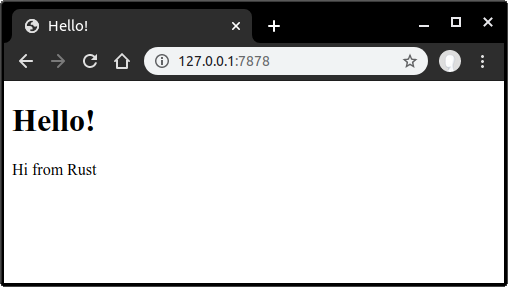

burst
=====

From working through

-	[The Rust Programming Language Kindle Edition](https://www.amazon.com/dp/B071YKRV8Q/)
-	https://doc.rust-lang.org/book/

## Chapter 20: Multi-threaded webserver

